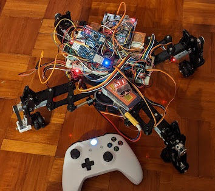
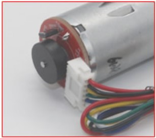

# spider-like_omniwheel_robot

This is a robot inspired by [Tachikoma](https://ghostintheshell.fandom.com/wiki/Tachikoma) from Ghost in the Shell. A robot with wheeled legs which allows it to switch between quadruped mode and vehicle mode.

This project was barely finished under a lot of compromise, due to series of inappropriate selection on software development platform and overthinking mechanical design. The robot is only capable in variable wheel angles by moving the position of its legs. Quadruped mode and other planned features are never implemented because of foreseeably  time-consuming efforts needed for completion.

## Hardware

### MCU

stm32f103rb nucleo

### Power Supply

MP1584EN DC-DC voltage regulator module (3A)

### Servo

MG995 servo (180 degree) x4

> note: 3A power supply is not enough to driver servo against any torque (eg: friction from ground). Continuing driving them will cause system blackout.

### Remote control

https://github.com/AlphenLai/arduino_nano_usb_host_shield

### Motor drivers

[TB6612FNG](https://www.sparkfun.com/datasheets/Robotics/TB6612FNG Breakout v11.zip) x2

### Motors 

25GA370 x4

280rpm, 12V

| Colour | definition |
| ------ | ---------- |
| Red    | Motor +    |
| Black  | Encoder -  |
| Yellow | Encoder A  |
| Green  | Encoder B  |
| Blue   | Encoder +  |
| White  | Motor -    |

### Wheel

1.5 inch omni wheel

### Chassis

[3D printed](./3D_printe_parts/)

Considered ease of program in omniwheel mode, and early planned "variable wheel angle", the legs are designed as concentric. This guarantee wheels being aligned to the centre as wherever the legs move, but also requires complicated mechanical design. This decision also scarified structural stability.

### Wiring

## Software

### OS

mbed-os. Unfortunately mbed-os is not designed for RTOS. It took a lot of efforts to implement the robot into the system.

| Module         | Usage                                                        |
| -------------- | ------------------------------------------------------------ |
| config         | Set pinout and global variables                              |
| controller     | Handles controller signals (from serial)                     |
| encoder        | Handles encoder feedbacks (signals proven to be delayed)  (discontinued) |
| extended_servo | Break servo movements by parts to create smooth transitions (discontinued) |
| hardware_io    | Handles physical inputs such as buttons/potentiometer        |
| **main**       | Program entry point. Registers modules as threads            |
| math_alg       | Provide algorithm computation service (discontinued)         |
| motion_control | Handles path following (discontinued)                        |
| motor_control  | Handles control signals to motor controller board            |
| pid            | Provide PID computation service (discontinued)               |
| placeholder    | Plain files for creating new module in mbed web compiler     |
| serial         | Handles serial traffic                                       |
| servo_control  | Handles servo movements                                      |
| usb_interface  | Handles usb interface in serial0/serial_pc. Receiver control signals from USB serial line. |

## Demo

